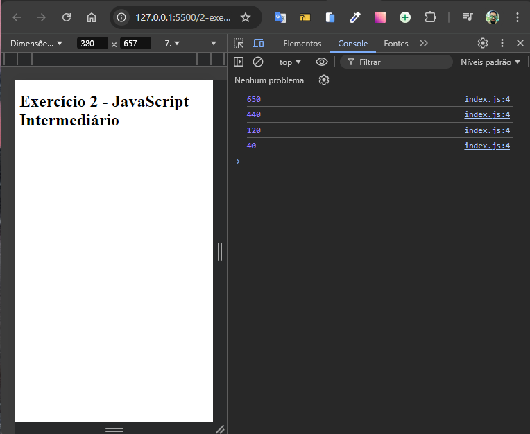

# Multiplicando por 10 com forEach

Desenvolvido como exercício de JavaScript intermediário do curso de extensão universitária do DevQuest - Dev em Dobro.

Este projeto demonstra o uso da função `forEach` em JavaScript para multiplicar cada número em um array por 10. É uma aplicação simples e educativa que visa praticar a iteração de arrays e manipulação de dados usando métodos nativos do JavaScript.



## Tecnologias Utilizadas

- **HTML**
- **CSS**
- **JavaScript**

## Como Usar

1. Clone este repositório:

   ```bash
   git clone https://github.com/Alberesbass/multiplicando-por-10-com-forEach.git
   ```

2. Abra o arquivo `index.html` em seu navegador para ver o resultado da multiplicação.

## Licença

Este projeto está sob a licença MIT. Consulte o arquivo [LICENSE](./LICENSE) para mais informações.

---

Desenvolvido por [Alberes](https://github.com/Alberesbass)

---